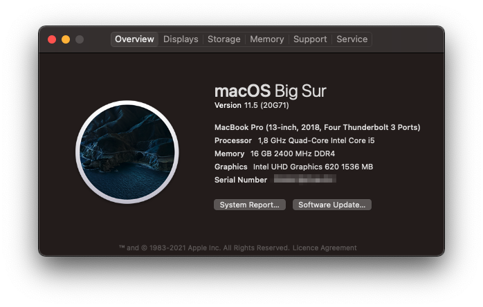
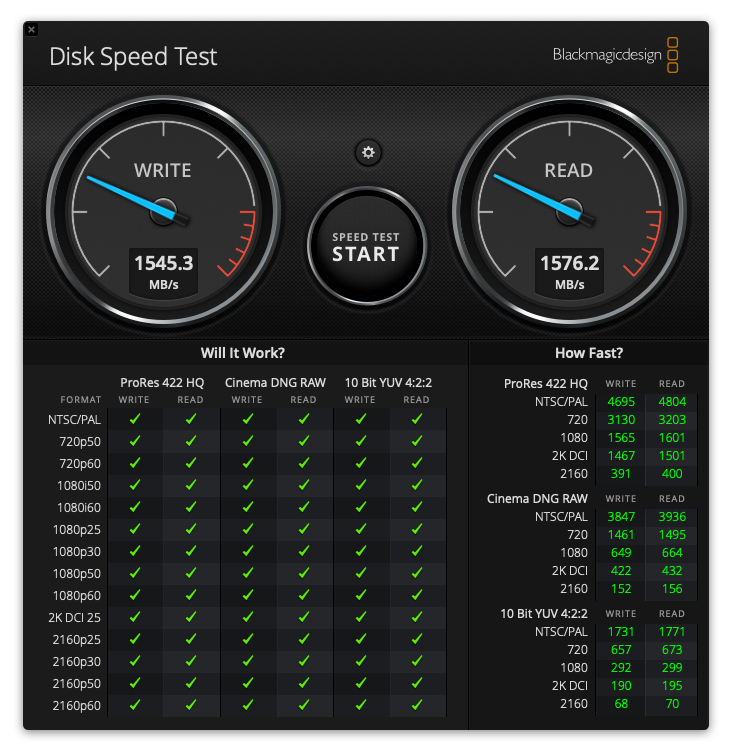
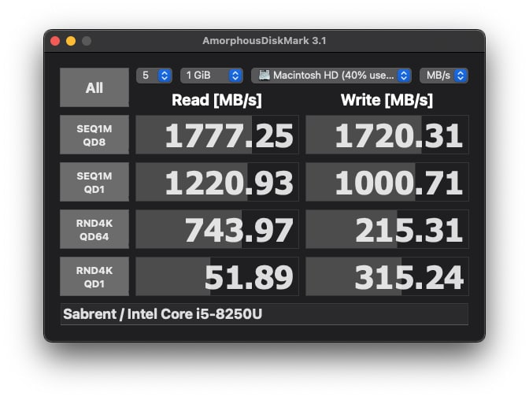
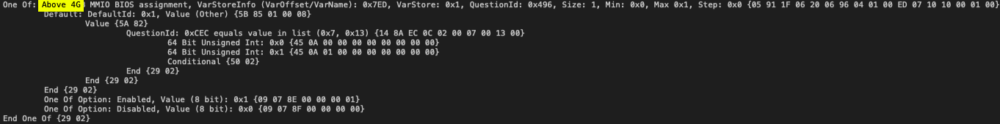

# OpenCore 0.7.3 - Dell Inspiron 5370 i5-8250U

## Specs

| Component      | Brand                                     |
|----------------|-------------------------------------------|
| **CPU**        | `Intel Core i5-8250U @ 1.8 GHz`           |
| **iGPU**       | `Intel UHD Graphics 620`                  |
| **Storage**    | `Western Digital SN750 Black NVMe 512GB`  |
| **Audio Code** | `Realtek ALC295 (ALC3254)`                |
| **WiFi Card**  | `BCM943602BAED aka DW1830`                |
| **OS**         | `macOS Big Sur 11.6 (20G165)`             |
| **BIOS**       | `v1.18`                                   |

### Working/Not working:

###### Click on the arrow icons to expand the spoilers

iGPU

  
- [x] Intel UHD 620 iGPU Backlight support
- [x] Intel UHD 620 iGPU HDMI1.4b Output (1920x1080@120Hz)
- [x] Intel UHD 620 iGPU Type-C to HDMI Output
- [x] Intel UHD 620 iGPU - H264 & HEVC

Audio

  
- [x] ALC295 Internal Speakers
- [x] ALC295 Internal Microphone
- [x] ALC295 Combojack headphones
- [ ] ALC295 Combojack microphone - Not interested at all
- [x] ALC295 HDMI Audio Output
- [x] ALC295 Type-C to HDMI Audio Output

USB

  
- [x] All USB ports working and mapped
- [x] Micro SD Card Reader (USB based)
- [x] Webcam (USB based)

Keyboard

  
- [x] Keyboard (PS2 based)
- [x] HID Key PWRB & SLPB 
- [x] F11 & F12 remapped brightness keys
- [x] F13 Print Screen remapped key
- [x] Multimedia control sound keys

Trackpad

  
- [x] I2C Touchpad with gestures
- [x] Force Touch

Misc

  
- [x] SpeedStep
- [x] Sleep/Wake using both `hibernatemode` `0` and `25`
- [x] Wi-Fi/BT 4.1 `BCM943602BAED` (`DW1830`) module
- [x] SATA/NVMe PCIe Gen3x4 on M.2 slot
- [x] Sensors CPU, iGPU, Battery, NVMe, Fans
- [x] Native ACPI Battery 8-bit support
- [x] Native NVRAM support
- [x] Recovery (macOS) boot from OpenCore
- [x] Windows 10/Linux boot from OpenCore

## Benchmarks

The following benchmarks were made using Geekbench V5:

- [CPU Single-core and Multi-core](https://browser.geekbench.com/v5/cpu/2830516)
- [GPU Metal](https://browser.geekbench.com/v5/compute/1173808)
- [GPU OpenCL](https://browser.geekbench.com/v5/compute/1173815)

### SSD

### RAM

## VideoProc Hardware Infos

## USB Preparing

Because I don't own a Mac I've created a VM of macOS Mojave 10.14.3 and downloaded the original installer from [gibMacOS](https://github.com/corpnewt/gibMacOS) and made the USB drive using [TINU](https://github.com/ITzTravelInTime/TINU/), a GUI for createinstallmedia. 

Luckily, there's a new way to download macOS Installer: for more infos check [@dortania](https://github.com/dortania) [guide](https://dortania.github.io/OpenCore-Install-Guide/installer-guide/mac-install.html)

For the bootloader configuration, I have to thank a lot [@1alessandro1](https://github.com/1alessandro1) and [@marianopela](https://github.com/marianopela), which helped me through the conversion from Clover to Opencore.

### SSDTs

| SSDT | Function |
| ---- | -------- |
| `SSDT-3-xh_OEMBD` | OEM USB SSDT customized for enabling just the necessary USB ports |
| `SSDT-EC-USBX` | Used for disabling your real Embedded controller and creating a fake one for macOS to play with ; USBX portion is used for injection USB power properties missing on Skylake and newer |
| `SSDT-GPI0` | Used for enabling GPI0 controller for trackpad. Paired with `SSDT-TPD0` |
| `SSDT-GPRW` | Used for fixing sleep problems - Requires `GPRW to XPRW` patch in `ACPI > Patch` |
| `SSDT-HPET-DISABLE` | Used for disabling HPET device on macOS |
| `SSDT-MCHC-SBUS` | Used for fixing SMBus support on macOS |
| `SSDT-PLUG` | Used for enabling Apple's XCPM in macOS, allowing for far better CPU power management |
| `SSDT-PNLF` | Used for controlling the backlight on internal display |
| `SSDT-PS2K` | Used for binding some keys like `Stamp to F13` and disabling `Swap command and option` |
| `SSDT-TPD0` | Way better alternative to `SSDT-XOSI` to force the trackpad behave like on Windows 8 - [infos](https://docs.microsoft.com/en-us/windows-hardware/drivers/acpi/winacpi-osi) |

### Drivers

| Driver | Function |
| ---- | -------- |
| `HfsPlus or OpenHfsPlus` | Allow detecting and booting from HFS+ formatted partitions |
| `OpenRuntime` | Memory correction driver. Essential |

### Kexts

| Kext | Function |
| ---- | -------- |
| [AirportBrcmFixup](https://github.com/acidanthera/AirportBrcmFixup) | Various patches for Broadcom Airport Wi-Fi cards |
| [AppleALC](https://github.com/acidanthera/AppleALC) | Native macOS HD audio for not officially supported codecs |
| [BrcmPatchRam](https://github.com/acidanthera/BrcmPatchRAM) | Broadcom Bluetooth kexts |
| [Lilu](https://github.com/acidanthera/Lilu) | Patching framework needed by most kexts |
| [NVMeFix](https://github.com/acidanthera/NVMeFix) | Improved power management for generic NVMe SSDs |
| [VirtualSMC](https://github.com/acidanthera/VirtualSMC) | Advanced SMC emulation |
| [VoodooI2C + VoodooI2CHID](https://github.com/alexandred/VoodooI2C) | Adds support for I2C trackpad |
| [VoodooPS2Controller](https://github.com/acidanthera/VoodooPS2) | Adds support for keyboard -  **VoodooPS2Mouse.kext** and **VoodooPS2Trackpad.kext** removed due to incompatibility with VoodooI2C kext itself |
| [WhateverGreen](https://github.com/acidanthera/WhateverGreen) | Various patches necessary for GPUs |

## BIOS Settings

After [extracting my BIOS](https://github.com/dreamwhite/bios-extraction-guide/tree/master/Dell) firmware and looking for `DVMT` and `CFG Lock`, I've applied those changes via `modGRUBShell.efi`:

**PLEASE DOUBLE CHECK THE OFFSETS**

- `Above 4G` to `Disabled` using `setup_var 0x7ED 0x00` (there's no sense of having it enabled, so double check if it's enabled or not)

- `CFG Lock` to `Disabled` using `setup_var 0x527 0x00`

- `CSM Support` to `Disabled` using `setup_var 0x104A 0x00`

- `DVMT Pre-allocated` to `64M` using `setup_var 0x7E8 0x2`

- `DVMT Total Gfx Mem` to `MAX` using `setup_var 0x7E9 0x3`

- `Serial Port` to `Disabled` using `setup_var 0x1272 0x00`

- `SW Guard Extension` to `Disabled` using `setup_var 0x5DC 0x00`

- `TPM State` to `Disabled` using `setup_var 0xF7A 0x00`

In this way, you won't need more `framebuffer-fbmem` and `framebuffer-stolenmem` properties under `DeviceProperties` for the graphics patch :) 

You can check the content of my BIOS [here](/BIOS/README.md)

## Brightness keys

I've realized (cuz I've removed Windows such as 10 seconds after buying the PC) that the brightness key are not smooth (fluid animation) even in Windows. So I've simply mapped them inside SysPrefs/Keyboard/Shortcuts 

## Crackling sound coming from combojack

Follow [README.md](headphones_fix/README.md)

## Fixing buggy MAT Support

Follow [README.md](SysReport/README.md)

## Gestures

Thanks to VoodooI2C team I've successfully activated native gestures on my hack. Everything is working except 4-fingers gestures, but who cares -_- 

## USB Mapping

## WiFi/BT antenna wiring

## FileVault2

Follow [README.md](FileVault2/README.md)

# IORegistryExplorer dump

I attached a zip file containing my anonymized IORegistryExplorer dump by using [DarwinDumper](https://bitbucket.org/blackosx/darwindumper/downloads/). Every credits for the application goes to the developer.

You can download the dump [here](DarwinDumper_ioreg.zip)

Please note that if you're experiencing weird issues with the viewer, try another browser like Safari or Google Chrome

## Credits

* **Apple** for macOS
* [**Acidanthera**](https://github.com/acidanthera) for OpenCore and the majority of the kexts
* [**RehabMan**](https://github.com/RehabMan) for contributing to most of the ACPI patching guides I used
* [**macOS86 and its staff**](https://github.com/macos86) for helping me hackintoshing this laptop
* [**1alessandro1**](https://github.com/1alessandro1) and [**marianopela**](https://github.com/marianopela) <!-- wamawwo mawwone --> for helping me optimizing this EFI 
* **every other people that contributed to the hackintosh world :haha:**

