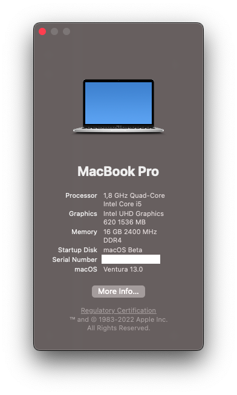

# OpenCore 0.8.1 - Dell Inspiron 5370 i5-8250U

## Only for educational purposes

[-white.svg)](https://www.apple.com/macos/monterey/)

## Specs

| Component      | Brand                                     |
|----------------|-------------------------------------------|
| **CPU**        | `Intel Core i5-8250U @ 1.8 GHz`           |
| **iGPU**       | `Intel UHD Graphics 620`                  |
| **Storage**    | `Western Digital SN750 Black NVMe 512GB`  |
| **Audio Code** | `Realtek ALC295 (ALC3254)`                |
| **WiFi Card**  | `Fenvi BCM94360NG with native firmware`   |
| **OS**         | `macOS Monterey 12.4 (21F79)`             |
| **BIOS**       | `v1.22`                                   |

### Working/Not working:

###### Click on the arrow icons to expand the spoilers

iGPU

  
- [x] Intel UHD 620 iGPU Backlight support
- [x] Intel UHD 620 iGPU HDMI1.4b Output (1920x1080@120Hz)
- [x] Intel UHD 620 iGPU Type-C to HDMI Output
- [x] Intel UHD 620 iGPU - H264 & HEVC

Audio

  
- [x] ALC295 Internal Speakers
- [x] ALC295 Internal Microphone
- [x] ALC295 Combojack headphones
- [ ] ALC295 Combojack microphone - Not interested at all
- [x] ALC295 HDMI Audio Output
- [x] ALC295 Type-C to HDMI Audio Output

USB

  
- [x] All USB ports working and mapped
- [x] Micro SD Card Reader (USB based)
- [x] Webcam (USB based)

Keyboard

  
- [x] Keyboard (PS2 based)
- [x] HID Key PWRB & SLPB 
- [x] F11 & F12 remapped brightness keys
- [x] F13 Print Screen remapped key
- [x] Multimedia control sound keys

Trackpad

  
- [x] I2C Touchpad with gestures
- [x] Force Touch

Misc

  
- [x] SpeedStep
- [x] Sleep/Wake using both `hibernatemode` `0` and `25`
- [x] Wi-Fi/BT 4.1 `BCM94360NG` module with Continuity and Airdrop support (both from iPhone to Mac and viceversa)
- [x] SATA/NVMe PCIe Gen3x4 on M.2 slot
- [x] Sensors CPU, iGPU, Battery, NVMe, Fans
- [x] Native ACPI Battery 8-bit support
- [x] Native NVRAM support
- [x] Recovery (macOS) boot from OpenCore
- [x] Windows 10/Linux boot from OpenCore

## Benchmarks

[For more infos read here](/Docs/README.md#benchmarks)

## USB Preparing

Because I don't own a Mac I've created a VM of macOS Mojave 10.14.3 and downloaded the original installer from [gibMacOS](https://github.com/corpnewt/gibMacOS) and made the USB drive using [TINU](https://github.com/ITzTravelInTime/TINU/), a GUI for createinstallmedia. 

Luckily, there's a new way to download macOS Installer: for more infos check [@dortania](https://github.com/dortania) [guide](https://dortania.github.io/OpenCore-Install-Guide/installer-guide/mac-install.html)

For the bootloader configuration, I have to thank a lot [@1alessandro1](https://github.com/1alessandro1) and [@marianopela](https://github.com/marianopela), which helped me through the conversion from Clover to Opencore.

### SSDTs

[For more infos read here](/Docs/README#ssdt)
### Drivers

[For more infos read here](/Docs/README#drivers)

### Kexts

[for more infos read here](/Docs/Kexts.md)

## BIOS Settings

[For more infos read here](/Docs/BIOS/README.md)

## Brightness keys

I've realized (cuz I've removed Windows such as 10 seconds after buying the PC) that the brightness key are not smooth (fluid animation) even in Windows. So I've simply mapped them inside SysPrefs/Keyboard/Shortcuts 

## Crackling sound coming from combojack

[For more infos read here](/Docs/headphones_fix/README.md)

## Fixing buggy MAT Support

[For more infos read here](/Docs/SysReport/README.md)

## Gestures

Thanks to VoodooI2C team I've successfully activated native gestures on my hack. Everything is working except 4-fingers gestures, but who cares -_- 

## USB Mapping

[For more infos read here](/Docs/ACPI/SSDT-3-xh_OEMBD.md)

## WiFi/BT

[For more infos read here](/Docs/wifi_and_bt/README.md)
## FileVault2

[For more infos read here](/Docs/FileVault2/README.md)

# Graphics patch

[For more infos read here](/Docs/graphics_patch/README.md)

# IORegistryExplorer dump

I attached a zip file containing my anonymized IORegistryExplorer dump by using [DarwinDumper](https://bitbucket.org/blackosx/darwindumper/downloads/). Every credits for the application goes to the developer.

You can download the dump [here](/Docs/DarwinDumper_ioreg.zip)

Please note that if you're experiencing weird issues with the viewer, try another browser like Safari or Google Chrome

## FileVault2

Follow [README.md](/Docs/hidpi/README.md)

## Credits

* **Apple** for macOS
* [**Acidanthera**](https://github.com/acidanthera) for OpenCore and the majority of the kexts
* [**RehabMan**](https://github.com/RehabMan) for contributing to most of the ACPI patching guides I used
* [**macOS86 and its staff**](https://github.com/macos86) for helping me hackintoshing this laptop
* [**1alessandro1**](https://github.com/1alessandro1) and [**marianopela**](https://github.com/marianopela) <!-- wamawwo mawwone --> for helping me optimizing this EFI 
* **every other people that contributed to the hackintosh world :haha:**

## Donate

> This smol project is **free**, **open source** and I aim to provide all the necessary support 
> Why donate? I spend my spare time to work on this project to provide the best documentation ever. Internet is filled of bullshit and unneeded stuff. **THANK YOU!**

  

