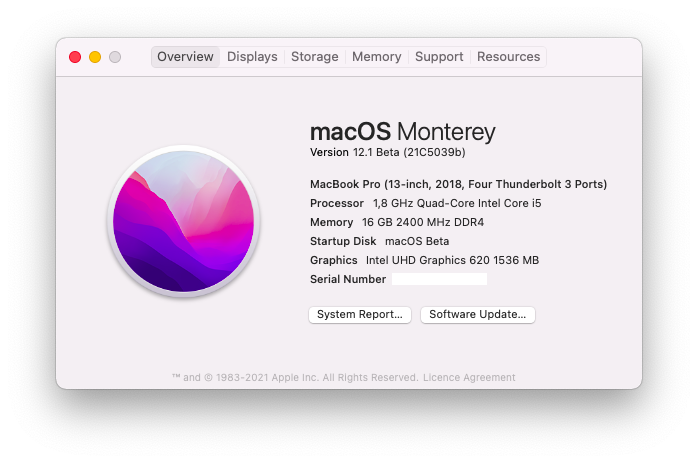

# OpenCore 0.6.7 - Dell Inspiron 5370 i5-8250U

## Specs

| Component      | Brand                                     |
|----------------|-------------------------------------------|
| **CPU**        | `Intel Core i5-8250U @ 1.8 GHz`           |
| **iGPU**       | `Intel UHD Graphics 620`                  |
| **Storage**    | `Sabrent ROCKET NVMe PCIe M.2 2280 512GB` |
| **Audio Code** | `Realtek ALC295 (ALC3254)`                |
| **WiFi Card**  | `BCM943602BAED aka DW1830`                |
| **OS**         | `macOS Big Sur 11.1 (20D80)`              |
| **BIOS**       | `v1.17`                                   |

## Benchmarks

The following benchmarks were made using Geekbench V5:

- [CPU Single-core and Multi-core](https://browser.geekbench.com/v5/cpu/2830516)
- [GPU Metal](https://browser.geekbench.com/v5/compute/1173808)
- [GPU OpenCL](https://browser.geekbench.com/v5/compute/1173815)

### SSD

### RAM

## VideoProc Hardware Infos

## USB Preparing

Because I don't own a Mac I've created a VM of macOS Mojave 10.14.3 and downloaded the original installer from [gibMacOS](https://github.com/corpnewt/gibMacOS) and made the USB drive using [TINU](https://github.com/ITzTravelInTime/TINU/), a GUI for createinstallmedia. 

Luckily, there's a new way to download macOS Installer: for more infos check [@dortania](https://github.com/dortania) [guide](https://dortania.github.io/OpenCore-Install-Guide/installer-guide/mac-install.html)

For the bootloader configuration, I have to thank a lot [@1alessandro1](https://github.com/1alessandro1) and [@marianopela](https://github.com/marianopela), which helped me through the conversion from Clover to Opencore.

### Drivers

Must have for boot:

* OpenHfsPlus.efi
* OpenRuntime.efi

### Kexts

* [AirportBrcmFixup](https://github.com/acidanthera/AirportBrcmFixup)
* [AppleALC](https://github.com/acidanthera/AppleALC)
* Temporarely disabled [AppleBacklightSmoother](https://github.com/hieplpvip/AppleBacklightSmoother)
* [BrcmPatchRam](https://github.com/acidanthera/BrcmPatchRAM)
* [Lilu](https://github.com/acidanthera/Lilu)
* [NoTouchID](https://github.com/al3xtjames/NoTouchID)
* [NVMeFix](https://github.com/acidanthera/NVMeFix)
* [VirtualSMC](https://github.com/acidanthera/VirtualSMC)
* [VoodooI2C + VoodooI2CHID](https://github.com/alexandred/VoodooI2C)
* [VoodooPS2Controller](https://github.com/acidanthera/VoodooPS2) with **VoodooPS2Mouse.kext** and **VoodooPS2Trackpad.kext** removed due to incompatibility with VoodooI2C kext
* [WhateverGreen](https://github.com/acidanthera/WhateverGreen)

## BIOS Settings

After [extracting my BIOS](https://github.com/dreamwhite/bios-extraction-guide/tree/master/Dell) firmware and looking for `DVMT` and `CFG Lock`, I've applied those changes via `modGRUBShell.efi`:

**PLEASE DOUBLE CHECK THE OFFSETS**

- `Above 4G` to `Disabled` using `setup_var 0x7ED 0x00` (there's no sense of having it enabled, so double check if it's enabled or not)

- `CFG Lock` to `Disabled` using `setup_var 0x527 0x00`

- `CSM Support` to `Disabled` using `setup_var 0x104A 0x00`

- `DVMT Pre-allocated` to `64M` using `setup_var 0x7E8 0x2`

- `DVMT Total Gfx Mem` to `MAX` using `setup_var 0x7E9 0x3`

- `Serial Port` to `Disabled` using `setup_var 0x1272 0x00`

- `SW Guard Extension` to `Disabled` using `setup_var 0x5DC 0x00`

- `TPM State` to `Disabled` using `setup_var 0xF7A 0x00`

In this way, you won't need more `framebuffer-fbmem` and `framebuffer-stolenmem` properties under `DeviceProperties` for the graphics patch :) 

You can check the content of my BIOS [here](/BIOS/README.md)

## Brightness keys

I've realized (cuz I've removed Windows such as 10 seconds after buying the PC) that the brightness key are not smooth (fluid animation) even in Windows. So I've simply mapped them inside SysPrefs/Keyboard/Shortcuts 

## Crackling sound coming from combojack

Follow [README.md](headphones_fix/README.md)

## Fixing buggy MAT Support

Follow [README.md](SysReport/README.md)

## Gestures

Thanks to VoodooI2C team I've successfully activated native gestures on my hack. Everything is working except 4-fingers gestures, but who cares -_- 

## USB Mapping

## WiFi/BT antenna wiring

## FileVault2

Follow [README.md](FileVault2/README.md)

# IORegistryExplorer dump

I attached a zip file containing my anonymized IORegistryExplorer dump by using [DarwinDumper](https://bitbucket.org/blackosx/darwindumper/downloads/). Every credits for the application goes to the developer.

You can download the dump [here](DarwinDumper_ioreg.zip)

Please note that if you're experiencing weird issues with the viewer, try another browser like Safari or Google Chrome

## Credits

* **Apple** for macOS
* **Acidanthera** for some Lilu-based kexts
* **RehabMan** for DSDT patching guide
* **every other people that contributed to the hackintosh world :haha:**

