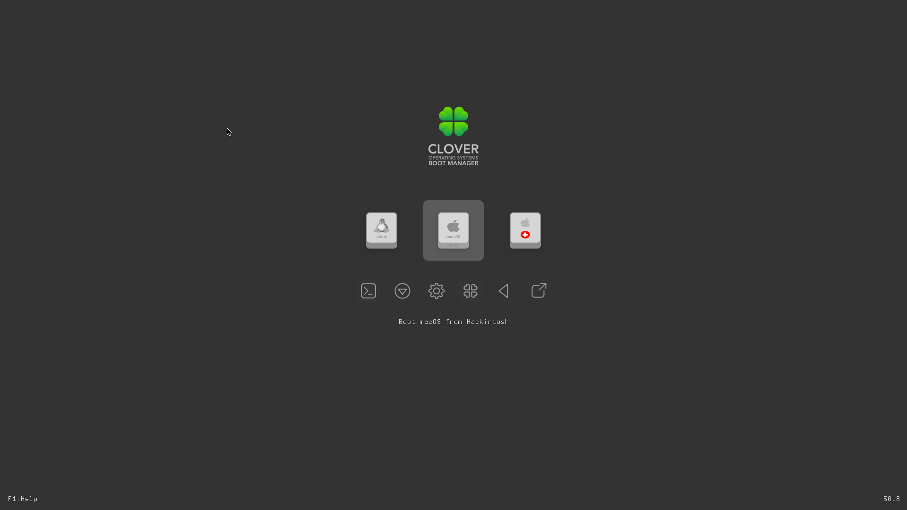
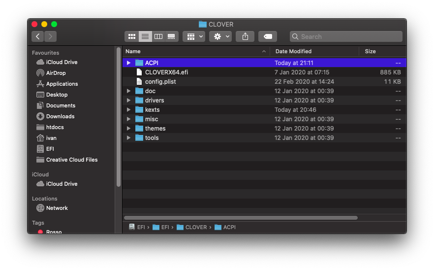

# Extracting ACPI tables

## Marcello, what is it?

An ACPI table is a AML file which... ehm... \*wtf is goin' on\*

For more infos check here:

* [kernel.org](https://www.kernel.org/doc/html/latest/arm64/acpi_object_usage.html)
* [OSDev Wiki](https://wiki.osdev.org/ACPI)
* [Microsoft Docs](https://docs.microsoft.com/en-us/windows-hardware/drivers/bringup/acpi-system-description-tables)

## What you doin'?

Extracting ACPI tables from my computer

## Mammamia Marcello, this is not how to extract ACPI tables

What you mean?

## This is how to extract them

## Requirements

* [Mount EFI](../bootloaders/mount-efi.md)
* config.plist/ACPI/SSDT/NoDynamicExtract=True
  * [meaning](../bootloaders/clover/conventions.md)
* MAMMAMIA


Don't extract ACPI tables using MaciASL or DPCIManager as they are already patched using DSDT with Clover/Opencore renames


### Step 1: identifying keyboard combination

While on Clover boot screen press F1 to open Help Menu

In the first case **F1**will call the standard **F1** key, else it will be **fn+F1**

### Step 2: extract ACPI tables


The following procedure is a background process, so don't expect any graphical output


Press **F4** \(or **fn+F4** if the fn keys are swapped\) and wait 30 seconds before booting

Then boot and after mounting the EFI open ACPI/origin folder

