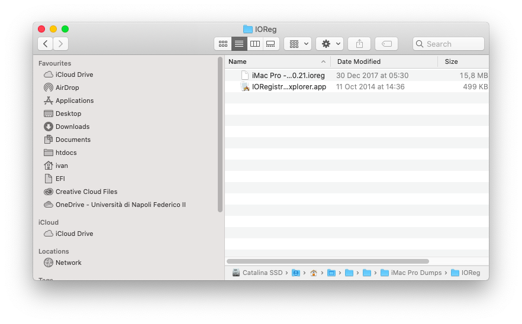
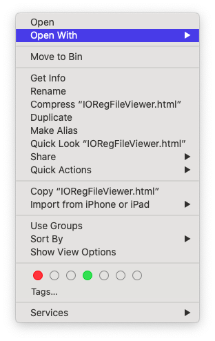
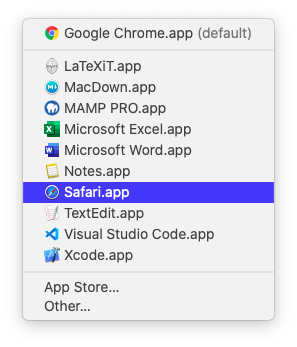
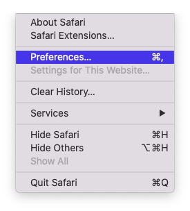

# Reading dump

## Requirements

* Download [dump](https://github.com/dreamwhite/mammamia-marcello-vanilla-guides/tree/master/acpi/original-acpi-and-ioregistryexplorer-from-macs)
* Web browser
  * Chrome
  * Safari

## Step 1: identify the right file

Download the file which name corresponds to your SMBIOS \(e.g. _MacBookPro14.1_ =&gt; _MacBookPro141.zip_\) and unzip it.

## Step 2: open IORegistryExplorer dump

### Dump.ioreg

### DarwinDump

Tick `Show Developer menu in menu bar` from Safari preferences

Then from `Develop` menu tick `Disable Local Restriction`

Reload the page and enjoy IORegistryExplorer from browser

