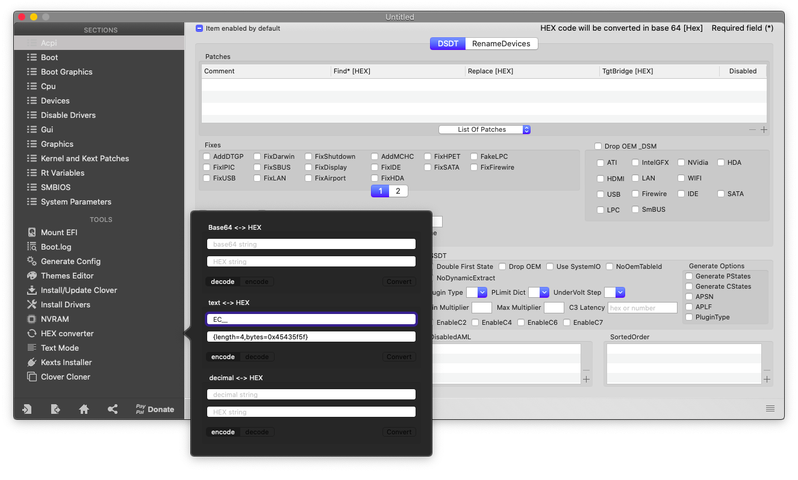
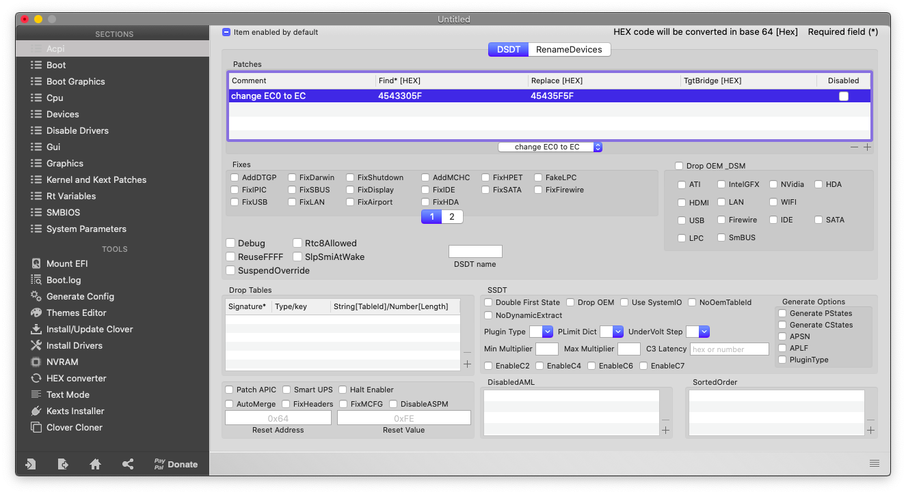

# Renames

## Marcello, what is it?

This is a collection of rename that are needed on macOS. This knowledge come from [here](https://applelife.ru/threads/dampy-originalnyx-makov.2943712/)

## What you doin'?

I'm trying to get my hackintosh more stable

## Mammamia Marcello, this is not how to do it

## What you mean?

## This is how to get a more stable hackintosh

### Requirements

* IORegistryExplorer
* [Mount EFI](../../bootloaders/mount-efi.md)
* Editing config.plist

## Step 1: determine which devices needs rename


Starting from macOS 10.15 Catalina, **EC** device is required for booting


Open IORegistryExplorer and look for the following devices:

* AC
* EHC1
* EHC2
* EUSB
* USBE
* GFX0
* PEGP
* HECI
* MEI
* SAT0
* LPC

Now take note of the devices that you've found previously and calculate the HEX of them as depicted below

## Step 2: add renames from Clover


TgtBridge is not needed for the majority of renames. Thus leave it blank. It's needed only for some renames like as done in [GenI2C](../../tools/geni2c.md)


#### Renames:

| Find | Replace |
| :--- | :--- |
| EC0 | EC |
| ECDV | EC |
| EHC1 | EH01 |
| EHC2 | EH02 |
| EUSB | EH01 |
| USBE | EH02 |
| GFX0 | IGPU |
| PEGP | GFX0 |
| HECI | IMEI |
| MEI | IMEI |
| SAT0 | SATA |
| LPC | LPCB |


You can use **any** HEX calculator



This method is preferred because, if there is any external reference to the renamed device, such as a SSDT, it will be automatically renamed by Clover


Note that if the device name length is less than 4 char add as many "\_" as there are missing characters to reach the length of 4 \(e.g. `EC0` will be `EC0_` \)

Add the rename as depicted below

Save `config.plist` and reboot

