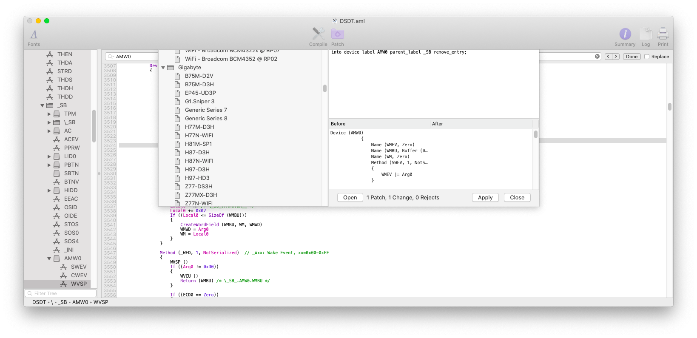
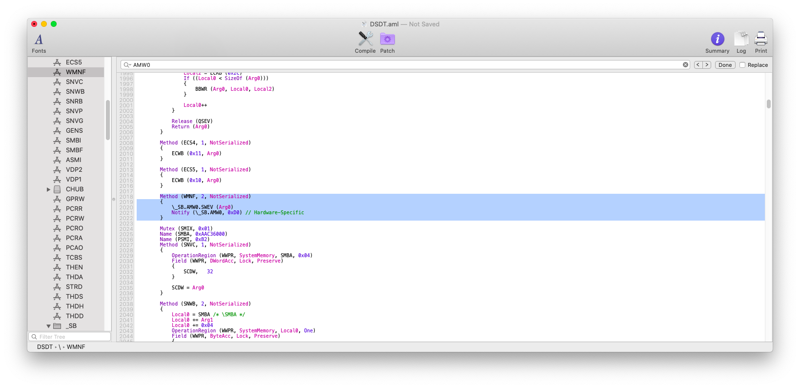
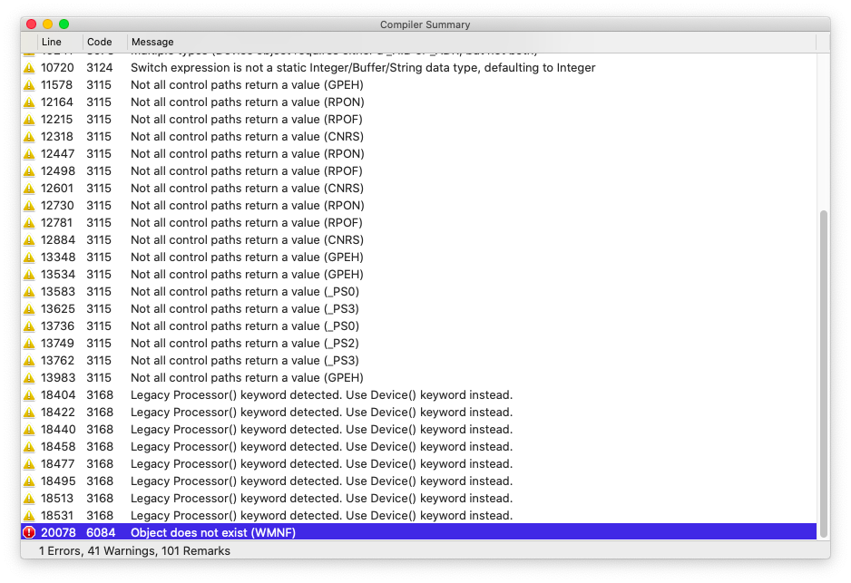
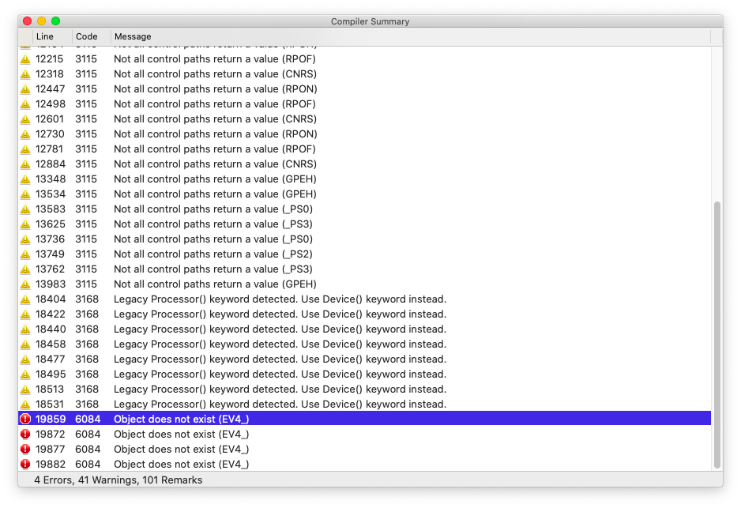
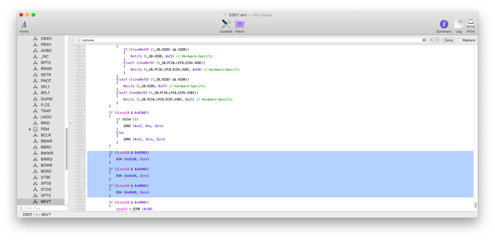
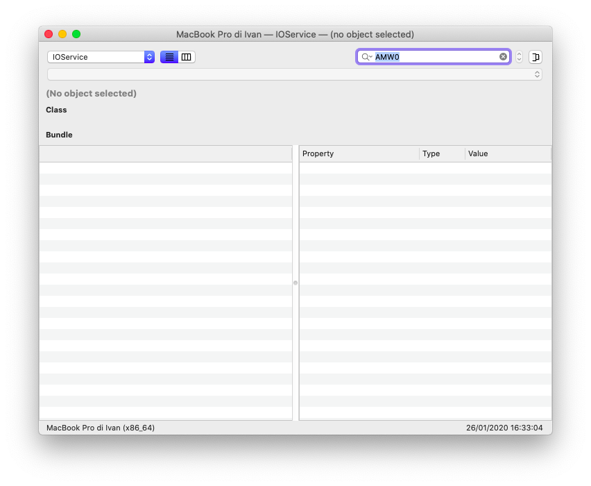

# Remove unused scopes and devices

## Marcello, what is it?

macOS kexts attaches to some devices that are defined in DSDT. But many of them aren't necessary

## What you doin'?

Removing unused scopes and devices from my hackintosh

## Mammamia Marcello, this is not how to remove unused scopes and devices from hackintosh

What you mean?

## This is how to remove unused scopes and devices from hackintosh


**Q:** Can this procedure break my hackintosh?  
**A:** The following procedure is safe your hackintosh. Just fix the ACPI errors.


## Requirements

* DSDT.aml
* * [Extracting ACPI tables](../extracting-acpi-tables.md)
* [MaciASL](../../tools/useful-tools/maciasl.md)
* [Mount EFI](../../bootloaders/mount-efi.md)
* [IORegistryExplorer](../../tools/debugging/ioregistryexplorer.md)
* IOReg export from same SMBIOS Mac

### Step 1: identify unused devices


Macs from the same family \(e.g. _MacBookPro15,x_ etc\) have a similar IORegistryExplorer structure


Open IORegistryExplorer and the previously downloaded same SMBIOS Mac IORegistryExplorer export file.


Then search for every single device that is in IORegistryExplorer and compare with the same SMBIOS Mac IORegistryExplorer export file.

You should have a result like the depicted below:


_AMW0_ doesn't appear in the MacBookPro 15,1 IORegistryExplorer export so just write it down in a list

### Step 2: removing them from DSDT and fixing errors


Syntax for MaciASL patches is available [here](https://sourceforge.net/p/maciasl/wiki/Patching%20Syntax%20Grammar/)


Open _DSDT.aml_ with MaciASL, clean it from errors and search for each device that you've wrote down previously.



Note that _AMW0_ path is _**\_SB.AMW0**_


Click on patch icon and add the following patch:

```text
into device label AMW0 parent_label _SB remove_entry;
```

_AMW0_ is the device we need to remove, _\_SB_ is the path.






Open again patch menu and apply the following patch

```text
into method label WMNF remove_entry;
```




Repeat the patching process by using the following syntax:

| Parameter | Value |
| :--- | :--- |
| OBJECT\_TYPE | All\|DefinitionBlock\|Scope\|Method\|Device\|Processor\|ThermalZone |
| LABEL | Object name \(e.g. WMNF\) |
| \[parent\_label PARENT\_LABEL\] | Path for object \(e.g. \_SB.PCI0 etc\) |

```text
into OBJECT_TYPE label [parent_label PARENT_LABEL] remove_entry;
```

After removing the devices click on every error and fix it as depicted below:




Proceed by fixing other errors in the same way



After cleaning DSDT from errors save it in `ECAP`and reboot.

The new IORegistryExplorer structure should be similar to the same SMBIOS machine.



