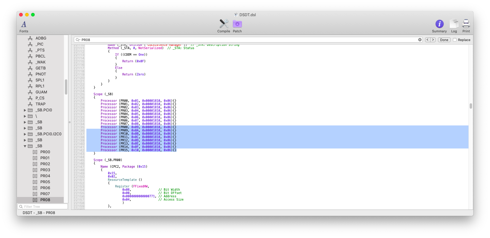
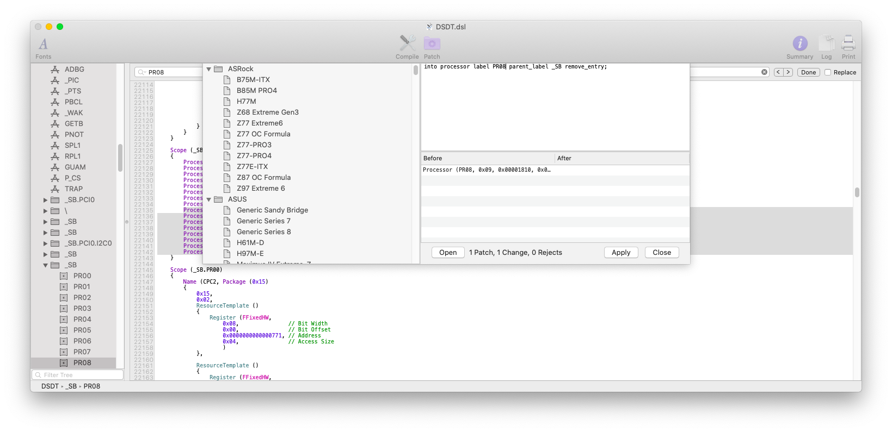
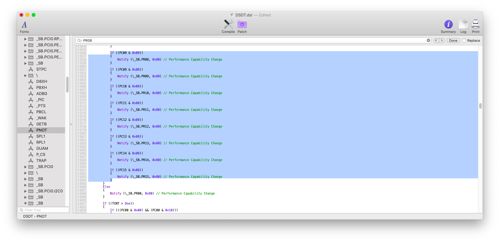

# CPU

In order to remove unused processors from IORegistryExplorer you need to know how many cores/threads does your CPU have \(e.g. 4/8 cores/threads CPU will have `PR00-PR07` entries in IORegistryExplorer

## Requirements:

* Core/Threads of your CPU
* DSDT.aml cleaned from errors
  * [Extracting ACPI tables](../extracting-acpi-tables.md)
* [MaciASL](../../tools/useful-tools/maciasl.md)
* [IORegistryExplorer](../../tools/debugging/ioregistryexplorer.md)

### Step 1: determine unused PRxx

Open IORegistryExplorer and look for PR entries. Write down the unused entires, whom doesn't have `AppleACPICPU` entry below. \(e.g. in the depicted screenshot `PR08 to PR15` are unused\)


### Step 2: remove unused PRxx from DSDT.aml

Open DSDT.aml with MaciASL and search the previously found `PRxx` like in the following screenshot



Now open Patch menu and apply the following patch, where `xx` is the `PRxx` that is unused.

```text
into processor label PRxx parent_label _SB remove_entry;
```



Repeat the patching process for each `Processor` that you need to remove.

Then compile and fix the remaining errors



We need to remove those lines because they call `_SB.PRxx` which we've removed before.

Fix the remaing errors with the same patching process.

Now save DSDT.aml in `/Volumes/EFI/EFI/CLOVER/ACPI/patched` and reboot


