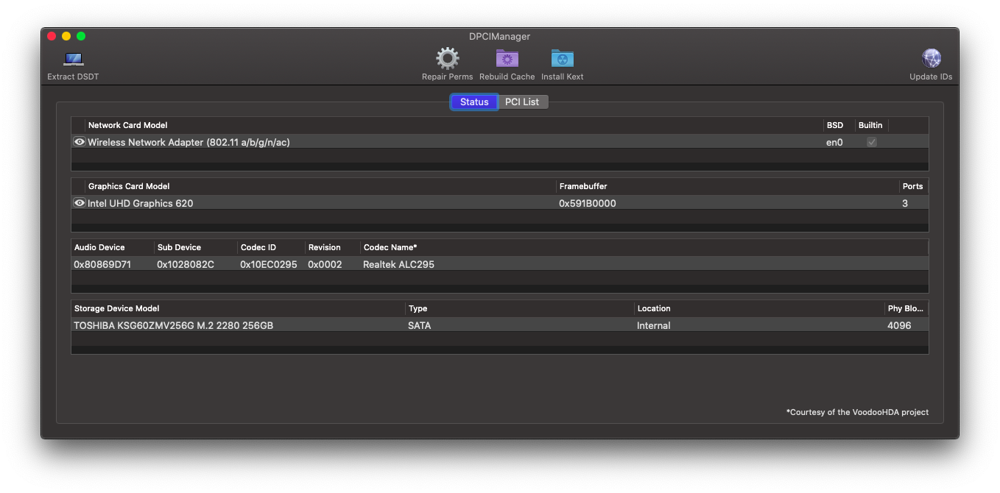
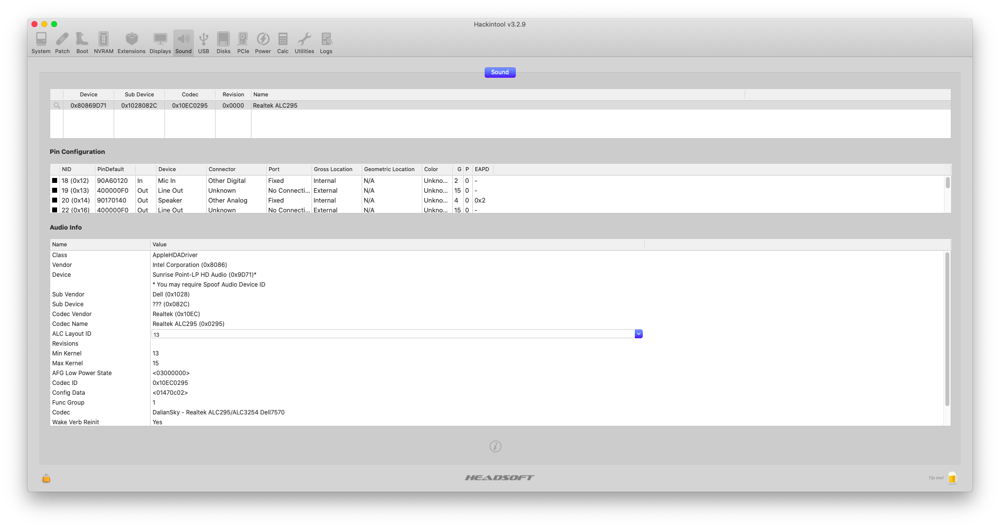
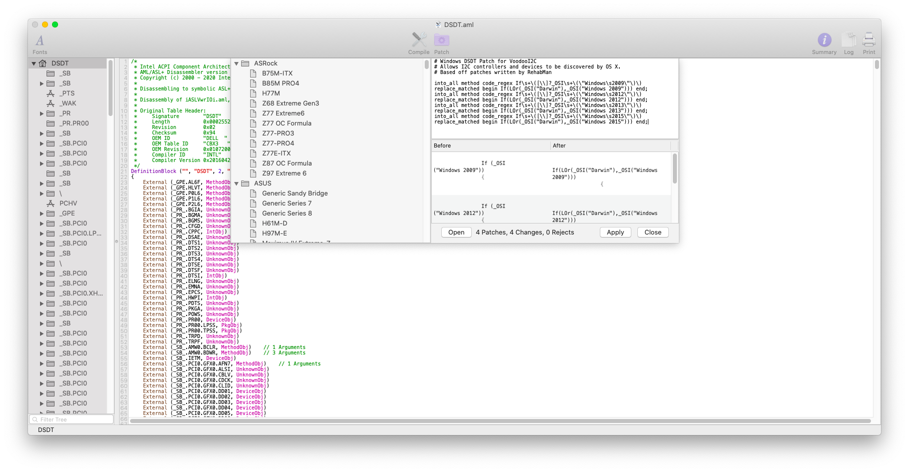

# AppleALC


**THE FOLLOWING SECTION IS FREE OF TYPOS/BROKEN IMAGES/SH\*T**



AppleALC and VoodooHDA are not compatible together. Use only **ONE** of them


## Marcello, what is it?

AppleALC is "an open source kernel extension enabling native macOS HD audio for not officially supported codecs without any filesystem modifications".

## What you doin'?

Enabling audio on my hackintosh

## Mammamia Marcello, this is not how to enable audio on hackintosh

What you mean?

## This is how to enable audio on hackintosh:

## Requirements

* [AppleALC compiled kext](https://github.com/acidanthera/AppleALC/releases)
* [Lilu compiled kext](https://github.com/acidanthera/Lilu/releases)
* Codec name
  * Motherboard manual
  * [DPCIManager](https://github.com/MuntashirAkon/DPCIManager/releases)
  * [Hackintool](http://headsoft.com.au/download/mac/Hackintool.zip)
* [AppleALC layout id list](https://github.com/acidanthera/AppleALC/wiki/Supported-codecs)
* [AppleALC Resources](https://github.com/acidanthera/AppleALC/tree/master/Resources)
* [Clover Configurator](https://mackie100projects.altervista.org/download-clover-configurator/)
* [gfxutil](https://github.com/acidanthera/gfxutil/releases)
* MAMMAMIA


Please note that AppleALC automatically renames HDAS/HDAU/BOD3 to HDEF  
Don't add those renames in Clover


### Step 1: identify codec name

* DPCIManager
* Hackintool





Please note that Hackintool suggest you some Layout IDs. In any case check the official AppleALC page for all layout ids




### Step 2: identify layout ID


Note the "layoutXX.xml" and proceed to the Installation step

### Step 3: installation

1. Verify that your Codec name is present in AppleALC layout id list
2. Put the compiled kexts inside `ECKO` folder


### Step 4: get DevicePath address using gfxutil

Download gfxutil and drag the executable inside the terminal and type `-f HDEF` as depicted below


Copy the DevicePath, `PciRoot(0x0)/Pci(0x1f,0x3)` and proceed to the next step

### Step 5: Clover Configurator


According to AppleALC [Installation and Usage](https://github.com/acidanthera/AppleALC/wiki/Installation-and-usage) page layout-id can be injected in different ways. Personally I prefer the following below. Check their page for more infos :\)


1. Mount your ESP 
2. Open your config.plist
3. Go in Devices/Properties section
4. Fill the fields as below


#### Code editor

Add the following code inside config.plist/Devices/Properties section

```text
<key>PciRoot(0x0)/Pci(0x1f,0x3)</key>
            <dict>
                <key>layout-id</key>
                <integer>13</integer>
            </dict>
```

### Step 6: check if audio is working


Make sure that _Internal Speakers_ is in Output devices



Test only speakers. For the 3.5mm combojack follow the next section




**N.B.** For combojack \(mic+headphone single jack\) follow the [combojack fix](3.5mm-combojack.md)

### Uninstall

Remove **AppleALC.kext** from `ECKO`

## Credits

* Acidanthera team for AppleALC and gfxutil
  * [https://github.com/acidanthera/AppleALC](https://github.com/acidanthera/AppleALC/) 
    * check their credits page

