# VoodooHDA


**THE FOLLOWING SECTION IS FREE OF TYPOS/BROKEN IMAGES/SH\*T**



AppleALC and VoodooHDA are not compatible together. Use only **ONE** of them


## Marcello, what is it?

VoodooHDA is an open source audio driver for devices compliant with the Intel High Definition Audio \(HDA\) specification.

## What you doin'?

Enabling audio on my hackintosh

## Mammamia Marcello, this is not how to enable audio on hackintosh

What you mean?

## This is how to enable audio on hackintosh

## Requirements

* [VoodooHDA](https://github.com/chris1111/VoodooHDA-2.9.2-Clover-V15/releases)

### Installing VoodooHDA

Download the latest kext release and open the .pkg file

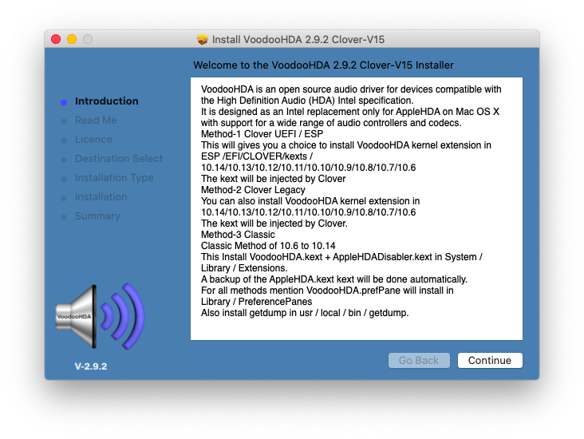


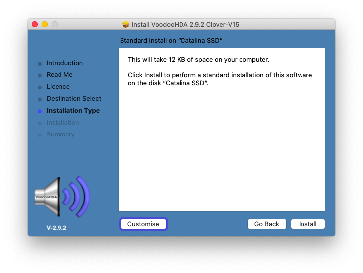

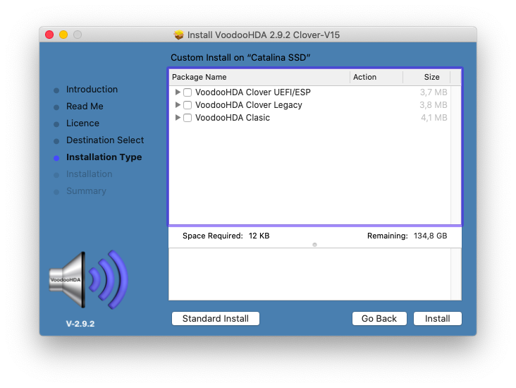

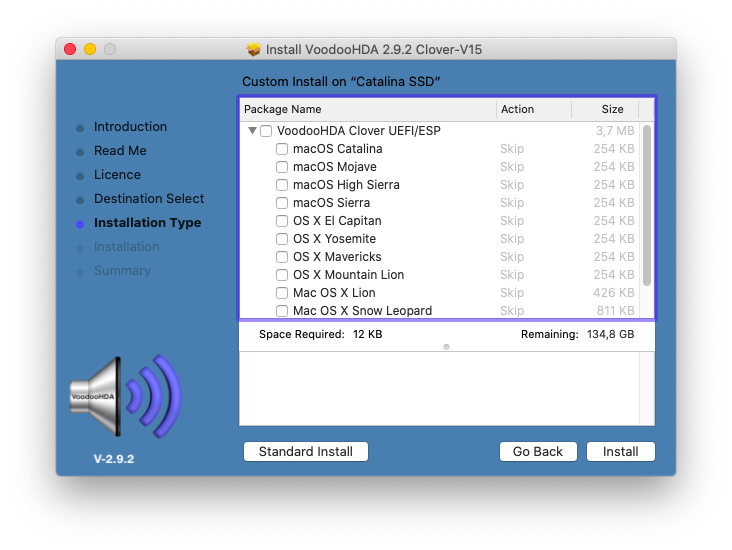

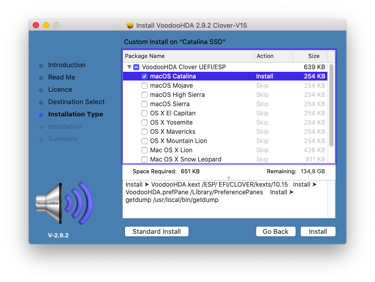

Click on Install, and enter your password when it's prompted.

### Uninstalling VoodooHDA

According to the previous screenshot, VoodooHDA installs 3 files:

* **VoodooHDA.kext** inside /ESP/EFI/CLOVER/kexts/**10.xx**
* **VoodooHDA.prefPane** inside /Library/PreferencePanes
* **getdump** inside /usr/local/bin/getdump

To remove the kext simply [mount EFI](../bootloaders/mount-efi.md) then remove VoodooHDA.kext as depicted below

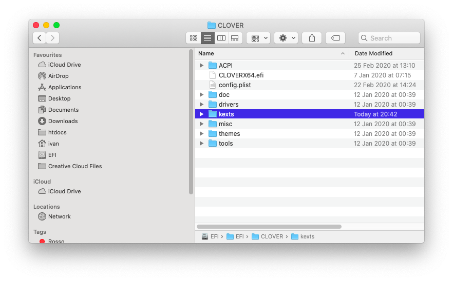


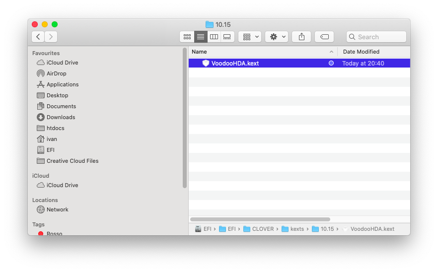

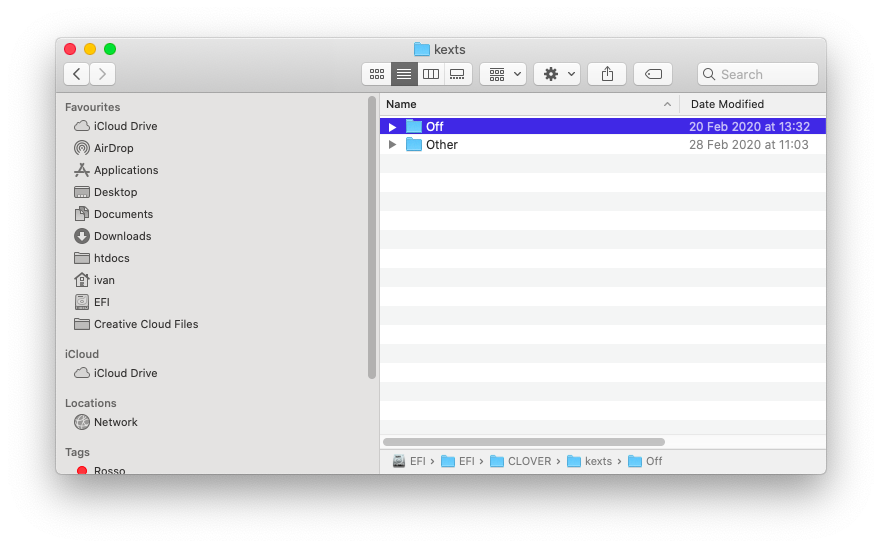

To remove the preference pane just open System Preferences as depicted below

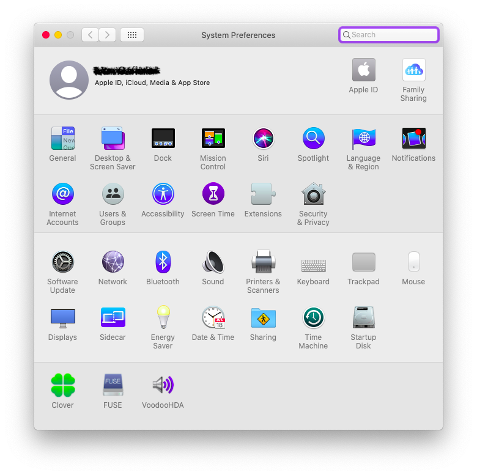

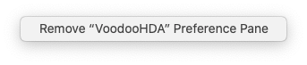

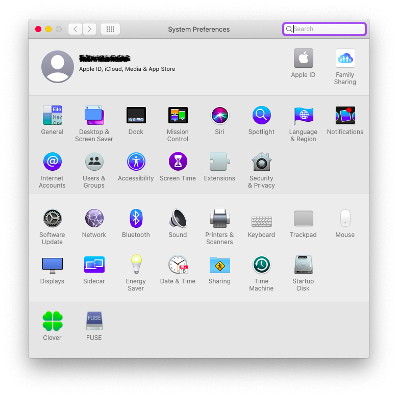

Finally, remove **getdump** by opening a terminal window:

Get the path to the executable with

```bash
which getdump
```


Then remove the executable with

```bash
# ONLY FOR NOOBS #

sudo rm -r /usr/local/bin/getdump

# OR FOR REAL PROs #

sudo rm -r $(which getdump)
```

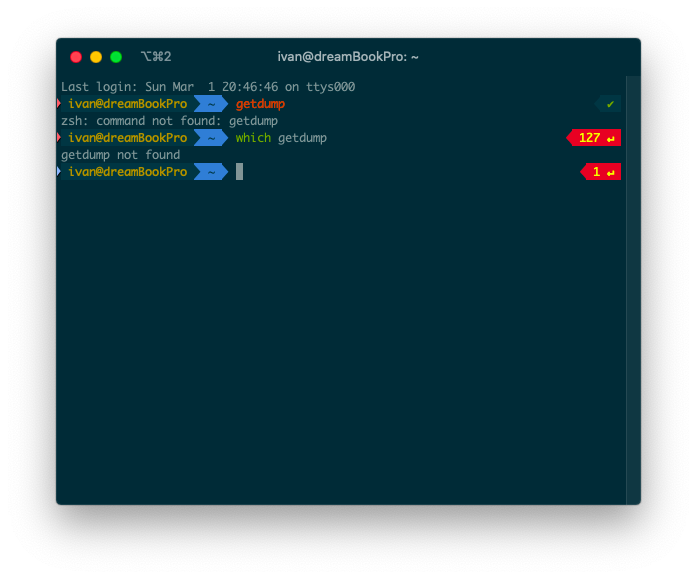


VoodooHDA is successfully uninstalled from your system. Remember to reboot in order to apply changes


