# VoodooI2C

## Marcello, what is it?

VoodooI2C is a project consisting of macOS kernel extensions that add support for I2C bus devices. The project is split into two main components: the core extension and various other satellite extensions.

## What you doin'?

Enabling trackpad on my hackintosh

## Mammamia Marcello, this is not how to enable trackpad on hackintosh

What you mean?

## This is how to enable trackpad on hackintosh


**Q:** Can this procedure break my hackintosh?  
**A:** The following procedure is safe your hackintosh. Just fix the ACPI errors.



Activating I2C devices requires **working** [EC](../../acpi/renames/ec.md) and [patched framebuffer](../../graphics/intel/)


## Requirements

* At least Intel Core Broadwell generation
* DSDT.aml
  * [Extracting ACPI tables](./)
* MaciASL
* Clover Configurator
* GenI2C
* VoodooI2C
* IORegistryExplorer

### Step 1: CPU Support

Open GenI2C and go in Diagnosis section

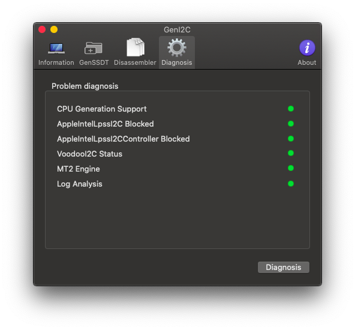


If CPU Generation Support led is red you can't add support for I2C devices on your laptop


### Step 2: editing config.plist


The following patches prevent Apple I2C kexts from attaching to I2C controllers. Without them, VoodooI2C can't never attach


Open config.plist and add those patches:

```text
++++++++++++++++++++++++++++++++++++++

    Name:           com.apple.driver.AppleIntelLpssI2C
    Find:           494F4B69 74
    Replace:        494F4B69 73
    Comment:        Prevent Apple I2C kexts from attaching to I2C controllers, credit CoolStar

    Name:           com.apple.driver.AppleIntelLpssI2CController
    Find:           494F4B69 74
    Replace:        494F4B69 73
    Comment:        Prevent Apple I2C kexts from attaching to I2C controllers, credit CoolStar


Please use the Rename(s) above in the given order

++++++++++++++++++++++++++++++++++++++
```

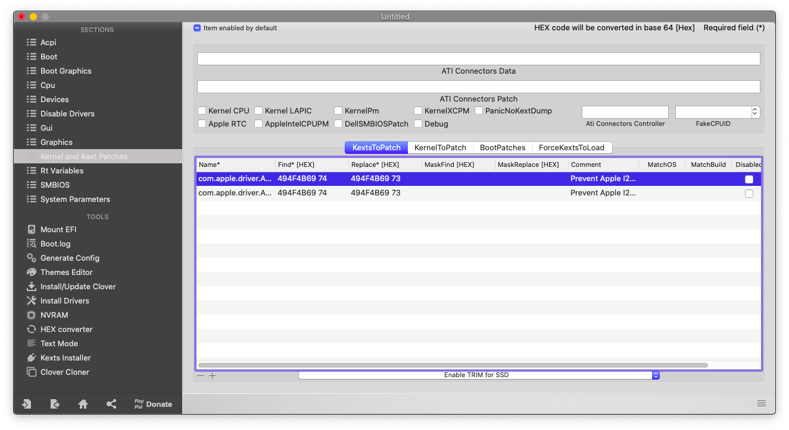

```text
<key>KextsToPatch</key>
        <array>          
            <dict>
                <key>Comment</key>
                <string>Prevent Apple I2C kexts from attaching to I2C controllers, credit CoolStar</string>
                <key>Disabled</key>
                <false/>
                <key>Find</key>
                <data>
                SU9LaXQ=
                </data>
                <key>InfoPlistPatch</key>
                <true/>
                <key>Name</key>
                <string>com.apple.driver.AppleIntelLpssI2C</string>
                <key>Replace</key>
                <data>
                SU9LaXM=
                </data>
            </dict>
            <dict>
                <key>Comment</key>
                <string>Prevent Apple I2C kexts from attaching to I2C controllers, credit CoolStar</string>
                <key>Disabled</key>
                <false/>
                <key>Find</key>
                <data>
                SU9LaXQ=
                </data>
                <key>InfoPlistPatch</key>
                <true/>
                <key>Name</key>
                <string>com.apple.driver.AppleIntelLpssI2CController</string>
                <key>Replace</key>
                <data>
                SU9LaXM=
                </data>
            </dict>
        </array>
    </dict>
```

Furthermore, force the loading of **IOGraphicsFamily.kext** by adding

`\System\Library\Extensions\IOGraphicsFamily.kext` inside config.plist/Kernel and Kext Patches/ForceKextsToLoad


```text
<key>ForceKextsToLoad</key>
        <array>
            <string>\System\Library\Extensions\IOGraphicsFamily.kext</string>
        </array>
```

### Step 3: patching DSDT

After extracting DSDT.aml and cleaning it from errors, with MaciASL, open Patch menu and apply the following patches

```text
# Windows DSDT Patch for VoodooI2C
# Allows I2C controllers and devices to be discovered by OS X.
# Based off patches written by RehabMan

into_all method code_regex If\s+\([\\]?_OSI\s+\(\"Windows\s2009\"\)\) replace_matched begin If(LOr(_OSI("Darwin"),_OSI("Windows 2009"))) end;
into_all method code_regex If\s+\([\\]?_OSI\s+\(\"Windows\s2012\"\)\) replace_matched begin If(LOr(_OSI("Darwin"),_OSI("Windows 2012"))) end;
into_all method code_regex If\s+\([\\]?_OSI\s+\(\"Windows\s2013\"\)\) replace_matched begin If(LOr(_OSI("Darwin"),_OSI("Windows 2013"))) end;
into_all method code_regex If\s+\([\\]?_OSI\s+\(\"Windows\s2015\"\)\) replace_matched begin If(LOr(_OSI("Darwin"),_OSI("Windows 2015"))) end;
```


Save the file also in "Disassemled ASL File" for the next step

### Step 4: kexts installation

Add `VoodooI2C.kext` and the `satellite kext`  
More infos can be found [here](https://voodooi2c.github.io/#Satellite%20Kexts/Satellite%20Kexts)


### Step 5: disable VoodooPS2Controller Mouse and Trackpad conflict

There are two ways for disabling `VoodooPS2Controller.kext` plugins `VoodooPS2Mouse.kext` and `VoodooPS2Trackpad.kext`. My favourite is the SSDT method:

```text
DefinitionBlock ("", "SSDT", 2, "hack", "I2C", 0)
{

    // Disable any VoodooPS2Trackpad and VoodooPS2Mouse devices from loading
    External (_SB.PCI0.LPCB.PS2K.RMCF, PkgObj)

    Name(_SB.PCI0.LPCB.PS2K.RMCF, Package()
    {
        "Mouse", Package()
        {
            "DisableDevice", ">y",
        },
        "Synaptics TouchPad", Package()
        {
            "DisableDevice", ">y",
        },
        "ALPS GlidePoint", Package()
        {
            "DisableDevice", ">y",
        },
        "Sentelic FSP", Package()
        {
            "DisableDevice", ">y",
        },
    })
}
```

But there is also a second method, more brutal which removes them from `VoodooPS2Controller.kext` . Right click on the kext and click on `Show Package Contents`.

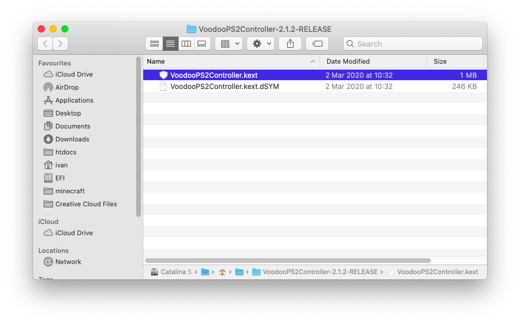


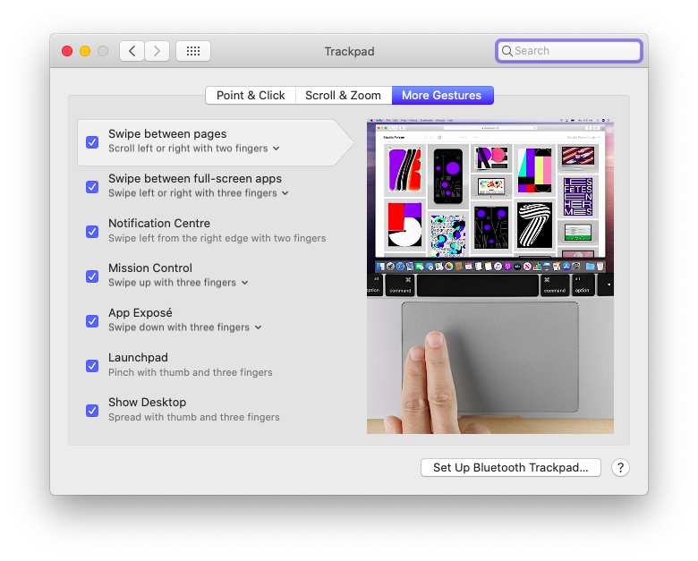

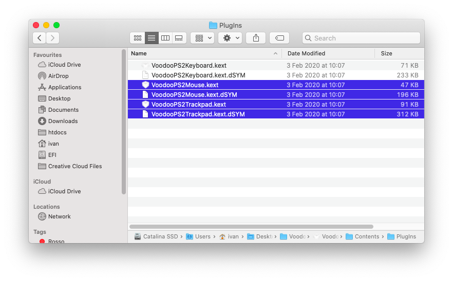

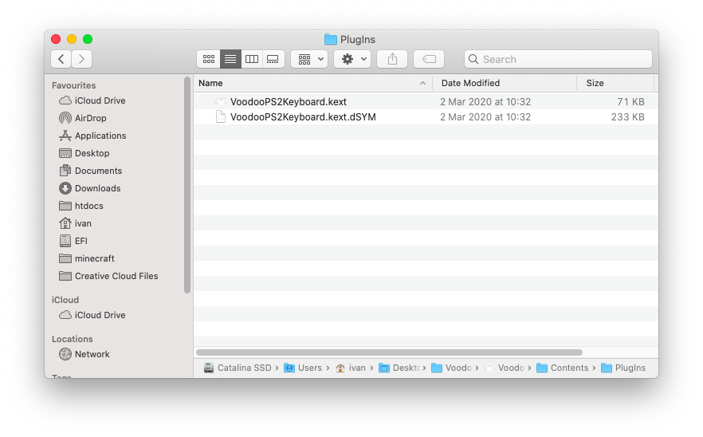

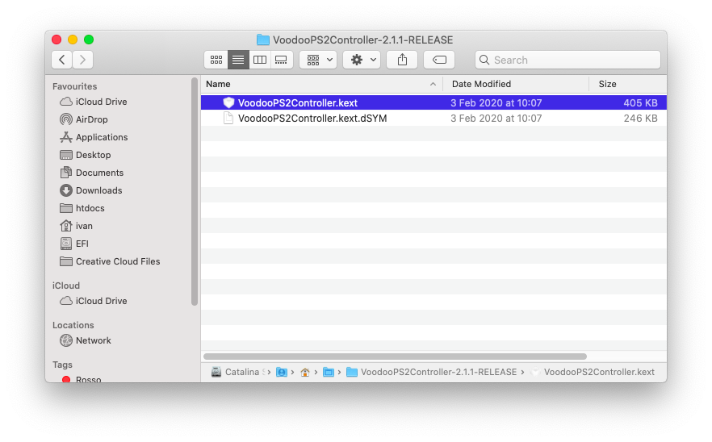

Finally copy **VoodooPS2Controller.kext** to `ECKO`

### Step 6: GenI2C


Marcello suggests using GenI2C on the target machine


After saving the DSDT.dsl file, open GenI2C and go in GenSSDT section

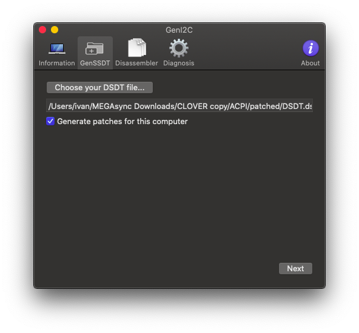

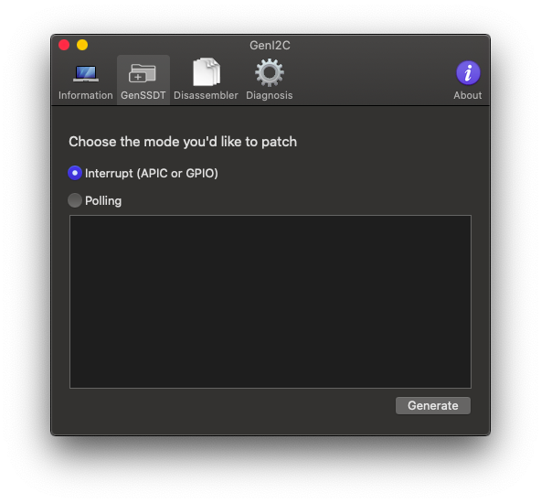

It will open a folder with Finder. Just copy the .aml file inside `/Volumes/EFI/CLOVER/ACPI/patched` directory

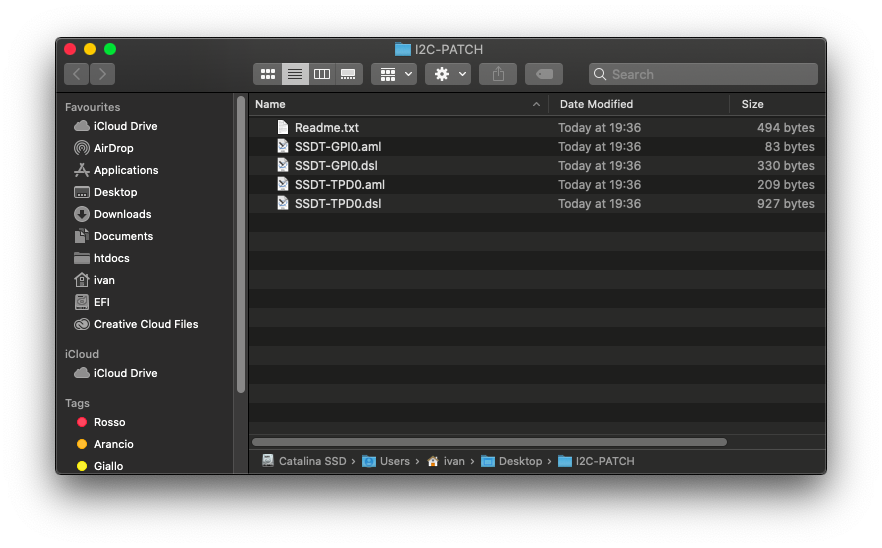

Then open your config.plist and add the renames inside Readme.txt

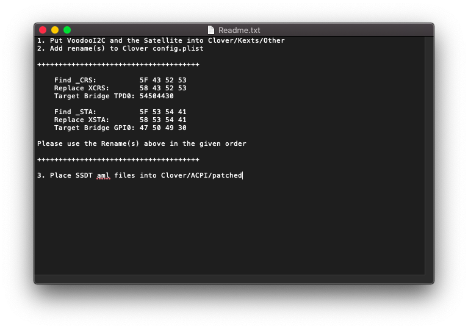

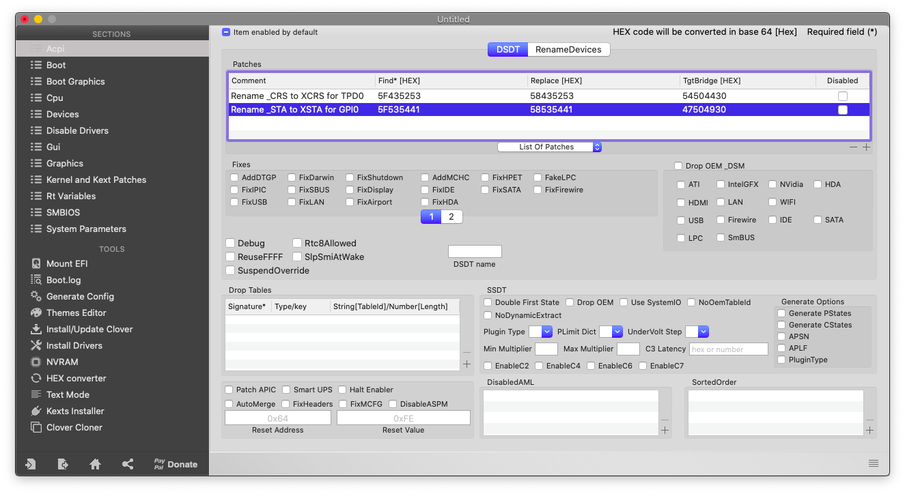

Save and reboot

### Step 7: configure trackpad

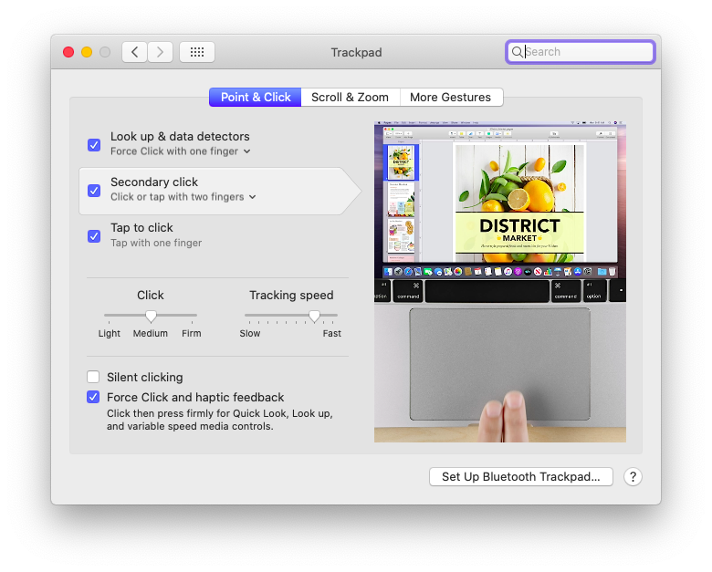

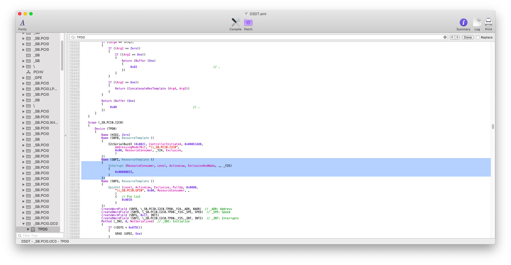

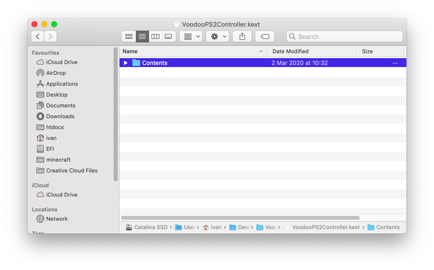

**Enjoy the gestures &lt;3**

## **Credits**

* [https://voodooi2c.github.io/\#GPIO%20Pinning/GPIO%20Pinning](https://voodooi2c.github.io/#GPIO%20Pinning/GPIO%20Pinning)

## Notes

For any trouble use official [Gitter chat](https://gitter.im/alexandred/VoodooI2C) from VoodooI2C.

