# Intel


**THE FOLLOWING SECTION IS FREE OF TYPOS/BROKEN IMAGES/SH\*T**



**Q:** Can this procedure break my hackintosh?  
**A:** The following procedure is safe your hackintosh. Just fix the ACPI errors.


## Why mapping USB ports?


This section is gently taken from [https://aplus.rs/2020/usb-mapping-how/](https://aplus.rs/2020/usb-mapping-how/). Every credits for this section goes to the author of the post


When you choose some Mac model to emulate – say iMacPro1,1 – macOS will load USB hardware map for that particular machine. Apple knows exactly what their models use as hardware configuration so they don’t really need to scan for available ports or other hardware \(like Windows or Linux must do\). Everything is known before-hand. One thing they know is that none of their machines have more than dozen ports per USB controller thus in 10.11 \(El Capitan\) they introduced hard limit of 15 ports per controller.

On the other hand, general PC hardware is infinitely varying. Most motherboards feature large number of internal and external ports. It’s not uncommon to see 6-8 or even more USB ports on the back panel I/O. Additional ports which are present on chassis are connected to internal points on the motherboard. Each USB 3.0 port is also backwards compatible with USB 2.0 hence each physical port is counted as 2 logical ports. Then you have USB-C ports which are USB 3.0/2.0 compatible but are reversible so they need to be treated a bit special.

In general, depending on the chipset and motherboard features, that 15-port limit can be easily blown.

Saving point here is that there are usually multiple USB controllers in PC hardware; how many, it depends on the chipset and manufacturer choices. External USB hubs and other devices do not count here, since whatever you attach shares that one port where it’s attached.

What all this means in practice?

Most obvious consequence is that some of those ports you have will simply not work. macOS will ignore any port enumerated over 15th on particular controller. There is no specific logic which ones will that be but usually it first enumerates USB 2.0 and then 3.0 logical ports. It’s possible that some ports will be ignored even if they are below 15th, simply due to enforced port map of the emulated Mac; on my ASRock motherboard, ports 1 and 9 were removed on one of the 3 controllers.

As you’ll see, this map is not sequential and physical ports map to \(more or less\) random positions in the logical map.

## Requirements

* DSDT/SSDT-USB.aml
* * [Extracting ACPI tables](../../acpi/extracting-acpi-tables.md)
* MaciASL
* Hackintool
* Clover Configurator
* IORegistryExplorer
* [USBInjectAll](../../installation/kexts/usb/usbinjectall.md#download-link)

## Step 1: Adding port limit patch

With the release of every macOS version you'll probably need a port-limit removal patch to begin your USB configuration on a new build.

Choose the patches for your OS version

### El Capitan \(10.11.x\)

| Name | Find | Replace |
| :--- | :--- | :--- |
| com.apple.driver.usb.AppleUSBXHCIPCI | 83BD8CFE FFFF10 | 83BD8CFE FFFF1B |

### Sierra \(10.12.x\)

| Name | Find | Replace |
| :--- | :--- | :--- |
| com.apple.driver.usb.AppleUSBXHCIPCI | 83BD74FF FFFF10 | 83BD74FF FFFF1B |

### High Sierra \(10.13.0 to 10.13.3\)

| Name | Find | Replace |
| :--- | :--- | :--- |
| com.apple.driver.usb.AppleUSBXHCIPCI | 837D8C10 | 837D8C1B |

### High Sierra \(10.13.4 to 10.13.5\)

| Name | Find | Replace |
| :--- | :--- | :--- |
| com.apple.driver.usb.AppleUSBXHCIPCI | 837D940F 0F839704 0000 | 837D940F 90909090 9090 |

### High Sierra \(10.13.6\)

| Name | Find | Replace |
| :--- | :--- | :--- |
| com.apple.driver.usb.AppleUSBXHCIPCI | 837D880F 0F83A704 0000 | 837D880F 90909090 9090 |

### Mojave \(10.14.x\)

| Name | Find | Replace |
| :--- | :--- | :--- |
| com.apple.iokit.IOUSBHostFamily | 83FB0F0F | 83FB3F0F |
| com.apple.iokit.IOUSBHostFamily | 83E30FD3 | 83E33FD3 |
| com.apple.driver.usb.AppleUSBXHCI | 83FB0F0F | 83FB3F0F |
| com.apple.driver.usb.AppleUSBXHCI | 83FF0F0F | 83FF3F0F |

### Catalina \(10.15.x\)

| Name | Find |  |
| :--- | :--- | :--- |
| com.apple.iokit.IOUSBHostFamily | 83FB0F0F | 83FB3F0F |
| com.apple.driver.usb.AppleUSBXHCI | 83F90F0F | 83F93F0F |

## Step 2: Installing the kext

[Mount EFI](../../bootloaders/mount-efi.md) and place in `/Volumes/EFI/EFI/CLOVER/kexts/Other` **USBInjectAll.kext**

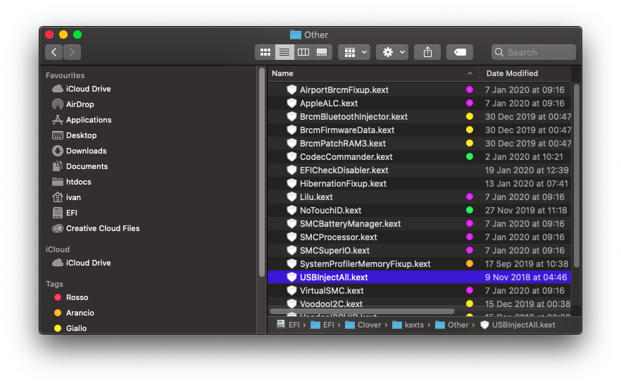

To ensure that the kext is correctly loaded in kernel cache type in a terminal window

```text
kextstat | grep USBInjectAll
```

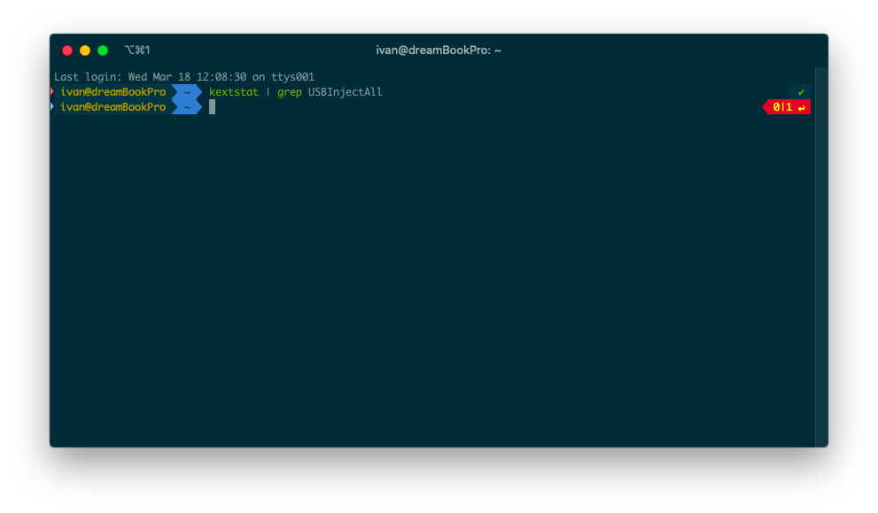

## Step 3: extract ACPI Tables



## Step 4: identify the SSDT which defines USB ports

From Intel Haswell generation onwards, USB ports are no more defined inside `DSDT.aml` but in an SSDT table.


Some newer machines have USB ports still defined in DSDT, just look for **HS01**


On my machine, USB ports are defined inside `SSDT-2-xh_OEMBD.aml`. Just open every single `SSDT-X-YYYYY.aml` with MaciASL and look for a tree like depicted in the following screenshot

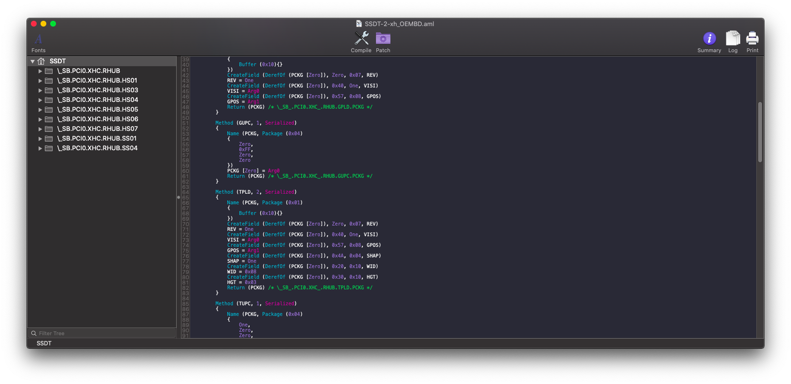

## Step 5: drop SSDT table loading

In order to load custom USB SSDT, drop the SSDT table which defines it.

According to [Advanced Configuration and Power Interface \(ACPI\) Specification, version 6.3](https://uefi.org/sites/default/files/resources/ACPI_6_3_May16.pdf), page [1009](https://uefi.org/sites/default/files/resources/ACPI_6_3_May16.pdf#page=1009), `DefinitionBlock` has the following syntax:

```text
DefinitionBlock (AMLFileName, TableSignature, ComplianceRevision, OEMID, TableID, OEMRevision)
{TermList}
```

| Parameter | Allowed value |
| :--- | :--- |
| AMLFileName | Desired name of the translated output AML file |
| TableSignature | 4-character ACPI signature |
| ComplianceRevision | 8-bit value |
| OEMID | 6-character string |
| TableId | 8-character string |
| OEMRevision | 32-bit value |
| TermList | Sequence of executable ASL expressions |

Open the SSDT and identify the `TableId` as depicted in the example below:


After identifying the TableId of the SSDT that must be dropped add it inside `config.plist`

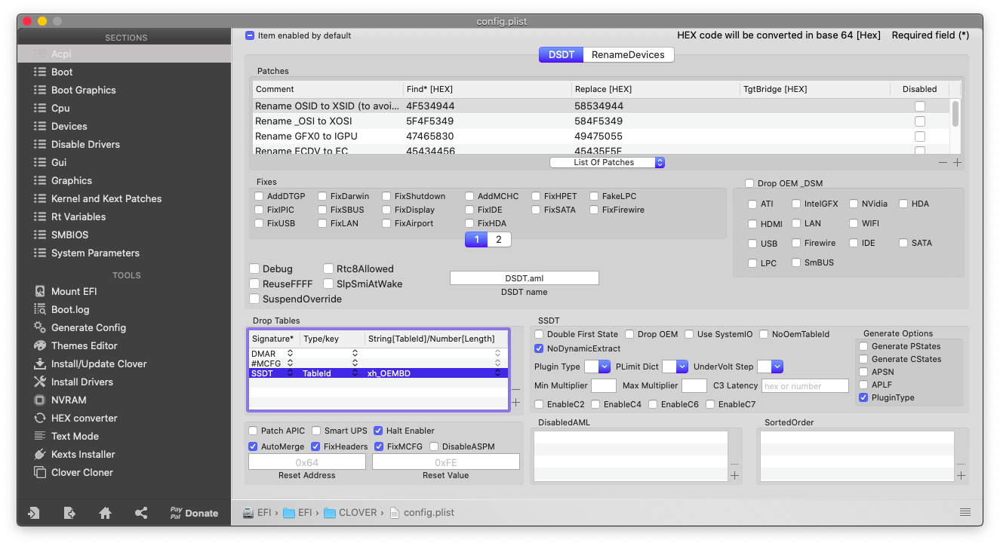

Or via code:

```text
<key>DropTables</key>
        <array>
            <dict>
                <key>Signature</key>
                <string>SSDT</string>
                <key>TableId</key>
                <string>xh_OEMBD</string>
            </dict>
        </array>
```

## Step 6: identify which port is active or not


**SSxx**, where **SS** stands for **S**uper **S**peed, ports are for USB3.0 \(meaning that **HS01** can have **SS01** etc.\). Their maximum speed is 5 Gbps while for USB2.0 are 480 Mbps


Open Hackintool and go in USB section


Click on the `Clear` button \(the third button from left\)

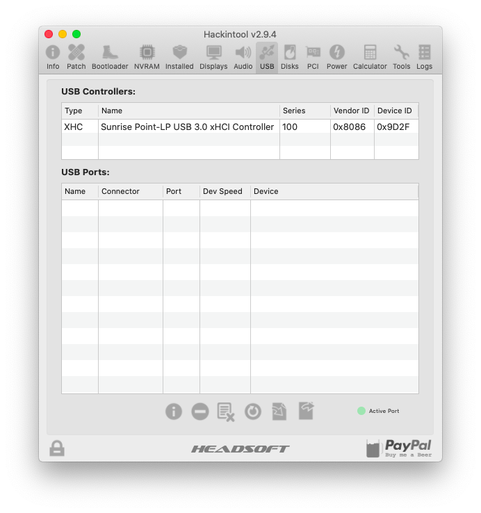

Then click on `Refresh` button \(the third from right\)

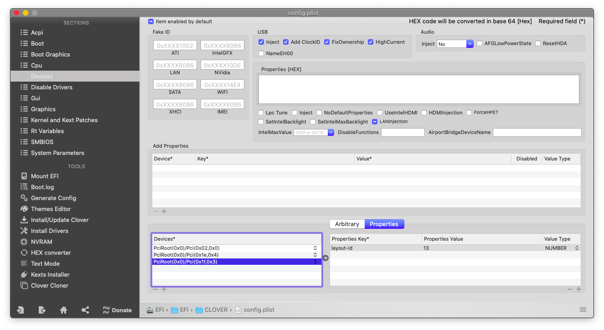

Finally connect a USB 2.0 in each port and note the `Name` of the USB port \(e.g. HS01 for right port of mobo etc.\)  
Then remove any port that isn't highlighted with the second button.

You should have a result like the depicted one below

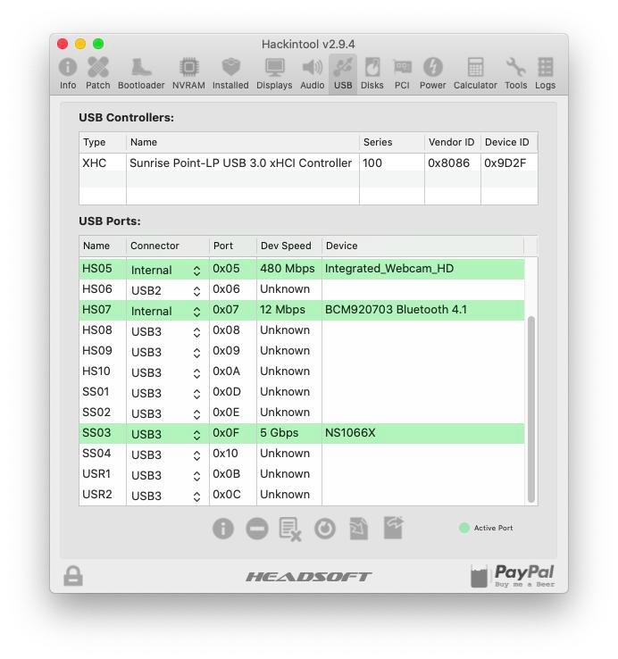

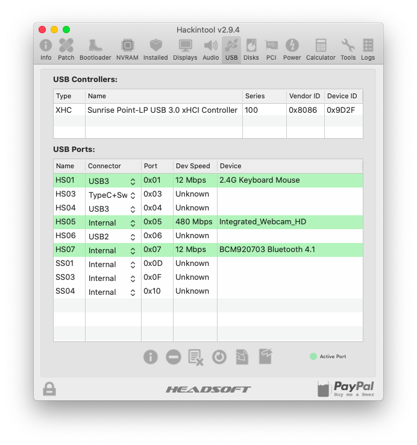

## Step 7: setup the ports inside SSDT

Open the previously identified SSDT with MaciASL


According to [Advanced Configuration and Power Interface \(ACPI\) Specification, version 6.3](https://uefi.org/sites/default/files/resources/ACPI_6_3_May16.pdf), page [673](https://uefi.org/sites/default/files/resources/ACPI_6_3_May16.pdf#page=673), `_UPC` method return the following Package:

```text
Return Value Information:
Package {
 Connectable // Integer (BYTE)
Type // Integer (BYTE)
 Reserved0 // Integer
 Reserved1 // Integer)
}
```

| Parameter | Values | Explanation |
| :--- | :--- | :--- |
| **Connectable** | Zero/One | Disabled port/Enabled port |
| **Type** | table below | Specifies the host connector type |

| Hex | USB Type |
| :--- | :--- |
| 0x00 | Type ‘A’ connector aka USB2 |
| 0x01 | Mini-AB connector |
| 0x02 | ExpressCard |
| 0x03 | USB 3 Standard-A connector |
| 0x04 | USB 3 Standard-B connector |
| 0x05 | USB 3 Micro-B connector |
| 0x06 | USB 3 Micro-AB connector |
| 0x07 | USB 3 Power-B connector |
| 0x08 | Type C connector - USB2-only |
| 0x09 | Type C connector - USB2 and SS with Switch |
| 0x0A | Type C connector - USB2 and SS without Switch |
| 0x0B-0xFE | Reserved |
| 0xFF | Proprietary connector |

Now just look for each port you've discovered before and fill a table like the below one e.g.

| Name | Connector type |
| :--- | :--- |
| HS01 | USB 3 Power-B connector |
| HS03 | Type C connector - USB2 and SS with Switch |
| HS04 | USB 3 Standard-A Connector |
| HS05 | Proprietary connector |
| HS06 | Type ‘A’ connector |
| HS07 | Type ‘A’ connector |
| SS01 | USB 3 Standard-B connector |
| SS04 | USB 3 Standard-A connector |

Then remove the unused ports from SSDT by applying the following patch


Replace **xx** with the unused port number previously found




```text
into scope label \_SB.PCI0.XHC.RHUB.HSxx remove_entry;
```



```text
into scope label \_SB.PCI0.XHC.RHUB.SSxx remove_entry;
```



Finally remove the unused external references to unused ports as depicted below

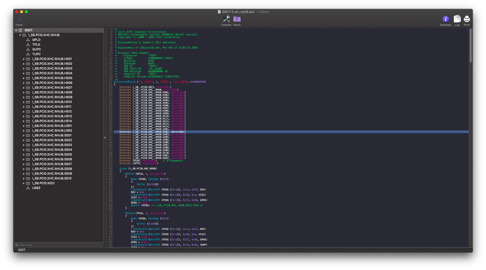

## Step 8: add the SSDT method

If we look closely to `GUPC` method, we can see that it assigns for each port the **Connector Type** _**Internal**._ We need to duplicate this method for defining the behaviour of USB2, USB3 and USB3 powered ports.

Just add the following method using MaciASL patch menu:



```text
# GENERIC METHOD #
# Credits to Gengik84

into scope label \_SB.PCI0.XHC.RHUB insert
begin
Method ( GENG, 2, NotSerialized)\n
{\n
Name (PCKG, Package (0x04)\n
{\n
Zero, \n
0x00, //Proprietary connector aka USB2\n
Zero, \n
Zero\n
})\n
PCKG [Zero] = Arg0 //This tells to replace the first element of our Package with the Arg0 that is passed\n
PCKG [One] = Arg1 //This tells to replace the first element of our Package with the Arg0 that is passed\n
Return (PCKG) /* \_SB_.PCI0.XHC_.RHUB.GENG.PCKG */
}
end;
```




For better reading, thought is useless, just place the methods from bottom file next to **GUPC** method


Replace `GUPC` method calls with `GENG([One]/Zero, TYPE)` where type is the port type which we've discovered previously

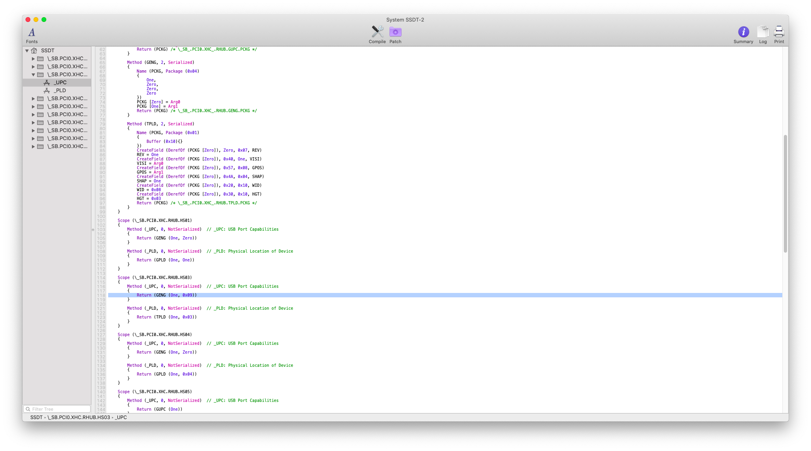

Look at the figures below

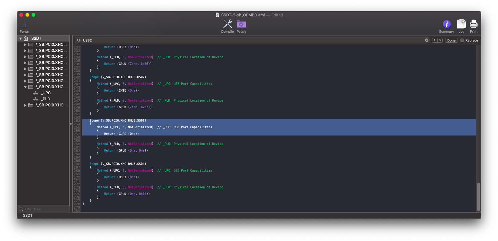


Save SSDT in `ECAP` , remove `USBInjectAll.kext` from `ECKO` and reboot.

Repeat **Step 4** and you should see something like the depicted one below

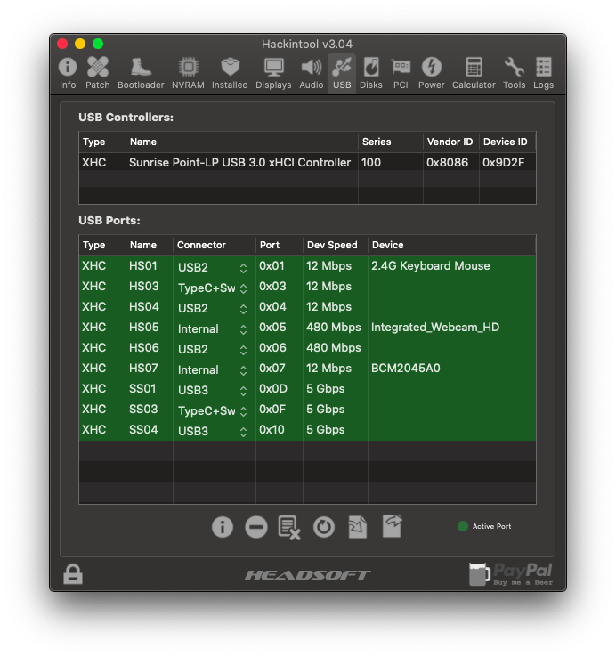

Enjoy your USB ports mapped

## Credits

* [MacOS86](https://www.macos86.it/topic/9-mappatura-porte-usb/page/1) Italian community

